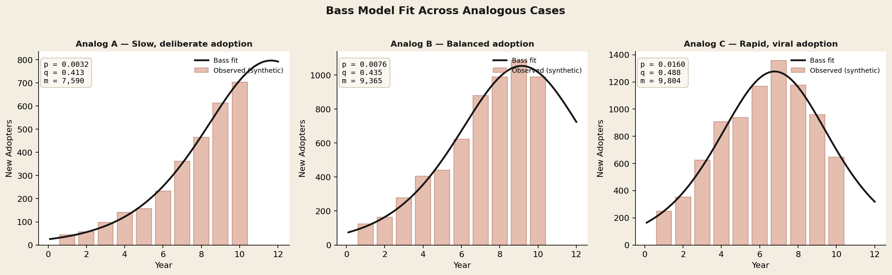
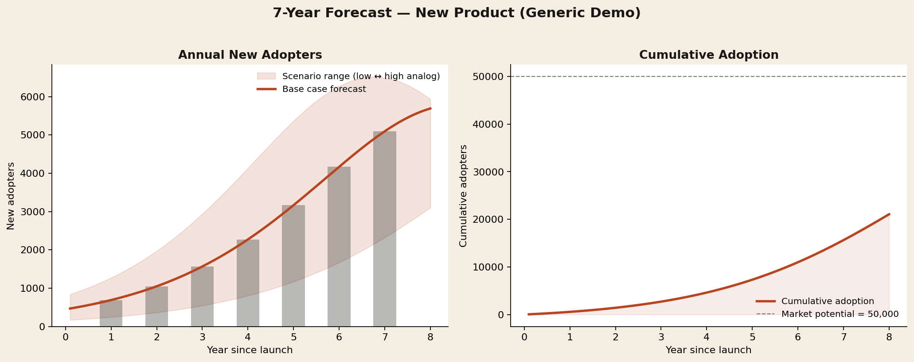

# Bass Diffusion Model — Adoption Forecasting

A clean, generic implementation of the **Bass Diffusion Model** for forecasting new-product adoption, built in Python. This is a sanitized reproduction of the methodology I used during a strategy engagement to forecast 7-year adoption of an emerging product category.

> **A note on confidentiality.** The actual client engagement, product, market sizing, and outputs are confidential. This repo demonstrates the *approach* — the math, the fitting procedure, the analog-anchored forecasting logic — using synthetic data and generic analog cases. Real client deliverables remain under NDA.

## The Problem

When you're forecasting demand for a product that has no direct historical sales data — a new technology category, a regulatory-cleared device, a new platform — traditional regression fails. There's nothing to regress on.

The Bass Diffusion Model (Bass, 1969) sidesteps this by anchoring the forecast on **analogous historical cases** and decomposing adoption into two behavioral forces:

- **Innovation (p):** people who adopt independently — the early movers
- **Imitation (q):** people who adopt because others already have — the social diffusion effect
- **Market potential (m):** the total addressable population, sized separately via TAM analysis

The model is structurally simple but surprisingly powerful: with three parameters, it produces realistic S-curve adoption forecasts that align with how products actually penetrate markets.

## What This Repo Does

The pipeline runs in four stages:

1. **Implements the Bass equations** from scratch in NumPy (no black-box library)
2. **Generates synthetic historical adoption data** for three analogous cases representing slow, balanced, and rapid diffusion
3. **Fits Bass parameters** to each analog using nonlinear least squares (SciPy)
4. **Forecasts 7-year adoption** for a hypothetical new product by anchoring on the analog parameters, with a scenario range from low to high analog assumptions

## Key Outputs

### Analog fits



Three synthetic analogs — slow/deliberate, balanced, and rapid/viral adoption patterns. The script recovers the underlying `p`, `q`, and `m` parameters from noisy observed data. Innovation coefficients range from `p ≈ 0.003` (regulated, deliberate) to `p ≈ 0.016` (low-friction, viral). Imitation coefficients cluster near `q ≈ 0.4–0.5`, consistent with published Bass meta-analyses.

### 7-year forecast



The base-case forecast (orange line) uses the average of the three analogs. The shaded band shows the range between the slowest and fastest analog scenarios — a useful sensitivity check for strategy conversations. Cumulative adoption shows the classic S-curve approaching but not reaching market saturation within the 7-year window.

## How to Run

```bash
pip install numpy pandas matplotlib scipy
python bass_diffusion.py
```

Outputs three files:
- `01_analog_fits.png` — analog case fits with recovered parameters
- `02_forecast.csv` — year-by-year forecast table
- `03_forecast.png` — annual adopters + cumulative adoption visualization

## Files

```
bass-diffusion-model/
├── README.md                  this file
├── bass_diffusion.py          full pipeline (~250 lines, documented)
├── 01_analog_fits.png         generated: analog case fits
├── 02_forecast.csv            generated: forecast table
└── 03_forecast.png            generated: forecast visualization
```

## Methodology Notes (What the Real Work Looks Like)

This is the generic demo. In a real strategy engagement, the work involves several non-trivial decisions that the model can't make for you:

**Analog selection.** The forecast is only as good as your analogs. In my engagement, I selected analogs based on regulatory pathway, buyer persona, switching cost, and category maturity — not just "products in the same industry." Bad analog selection is the #1 way Bass forecasts go wrong.

**Weighting.** This demo averages the three analogs equally. In practice, you weight by similarity to the target product. I used a simple similarity-scored weighting in the engagement.

**Market potential (m).** Bass doesn't tell you the market size — you have to size the TAM separately, usually via bottom-up unit economics. Getting `m` wrong throws off the absolute numbers but not the curve shape.

**Sanity checks.** Bass forecasts can look reasonable while being subtly wrong. Always cross-check against (a) installed base benchmarks, (b) the implied year-1 sell-through (does it pass the laugh test?), and (c) the second-derivative — the inflection point should align with when you expect word-of-mouth to kick in.

**What I delivered (anonymized).** A 7-year adoption forecast with high/base/low scenarios, anchored on 9 analogous cases, used to sequence go-to-market priorities and inform a partnership decision. Final outputs delivered to the client's Director of Strategy and C-suite.

## Why This Matters for Strategy Work

Bass Diffusion is one of the most useful quantitative tools in a strategy consultant's kit because:

1. **It forces structured thinking** about *why* people adopt — innovation vs. imitation
2. **It scales gracefully** from rough back-of-envelope to formal model
3. **It produces curves stakeholders can argue with** — easier to debate than a single-point forecast
4. **It's defensible** — every parameter traces back to a real-world analog

It's not a silver bullet. It assumes a single category, no major shocks, and stable buyer behavior. But as a starting point for an adoption conversation, it beats a spreadsheet of linear projections every time.

## References

- Bass, F. M. (1969). *A New Product Growth for Model Consumer Durables.* Management Science, 15(5), 215–227.
- Mahajan, V., Muller, E., & Bass, F. M. (1990). *New Product Diffusion Models in Marketing: A Review and Directions for Research.* Journal of Marketing, 54(1), 1–26.

---

**Author:** Ziah Lin · Honors Mechanical Engineering, Ohio State (Business Analytics minor) · [LinkedIn](https://www.linkedin.com/in/ziah-lin-541474206/)
